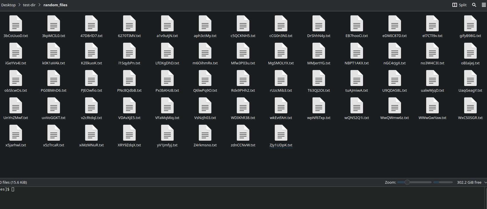

# File sorter

Basically this sorts all the files in the current directory. **It only sorts files that don't start with `.`**

### Before:



### After:


## Usage

cd into any directory through your terminal and run

```bash
file-sorter
```

## Installation

The easiest way is to run if you have cargo installed.

```bash
cargo install --git https://github.com/mrborghini/file-sorter.git
```

If you don't have Cargo installed. Don't worry!

You can also install by downloading a binary from [releases](https://github.com/mrborghini/file-sorter/releases) and renaming the binary to `file-sorter` or on Windows `file-sorter.exe` and adding it to your PATH.
